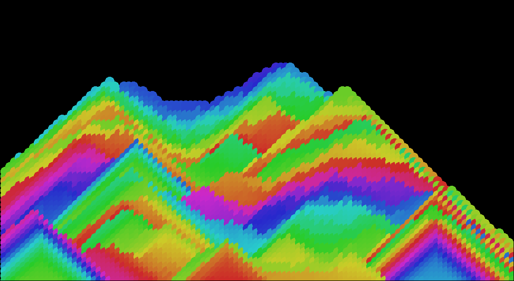
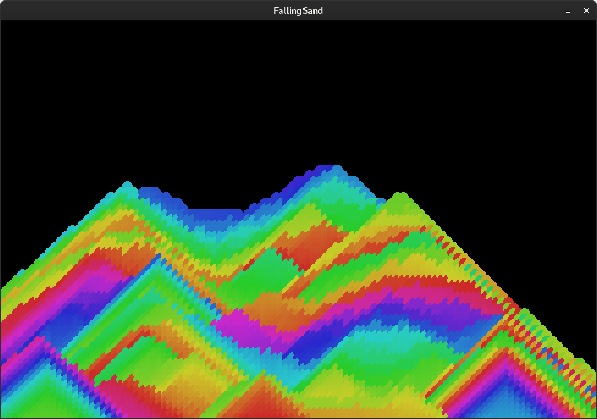

Este projeto é uma simulação de areia caindo.

Feito em C++ e SFML.

## Screenshot

Tela do programa após algumas iterações.



## Instalação

Detalhes logo abaixo com os requisitos e instruções

<details><summary>Show</summary>

### Requisitos

-   CMake
-   GCC/G++
-   Make
-   SFML

### Instruções:

1. Clone o repositório:

```
git clone https://github.com/lucasfturos/FallingSand.git && cd FallingSand
```

2. Crie a pasta build:

```
cmake -S . -B build
```

3. Entre na pasta e Compile o programa:

```
cd build ; make -j4
```

4. Execute o programa:

```
./src/FallingSand
```

</details>

## Créditos

1. [Coding Challenge 180: Falling Sand - The Coding Train](https://youtu.be/L4u7Zy_b868?si=NrrbIQL8i-JnHlBl)
2. [Press Start 2P Font - codeman38](https://www.1001fonts.com/press-start-2p-font.html)
